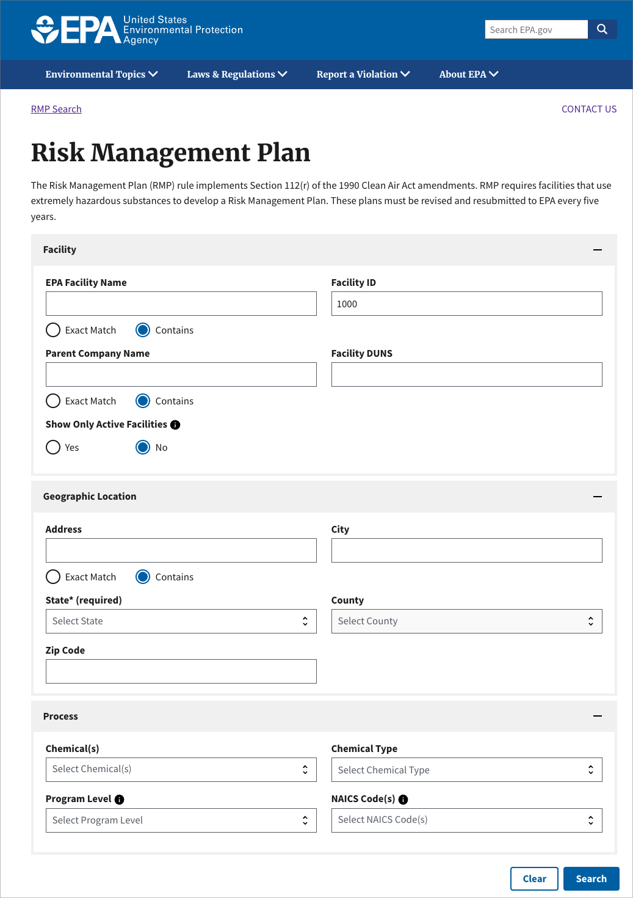
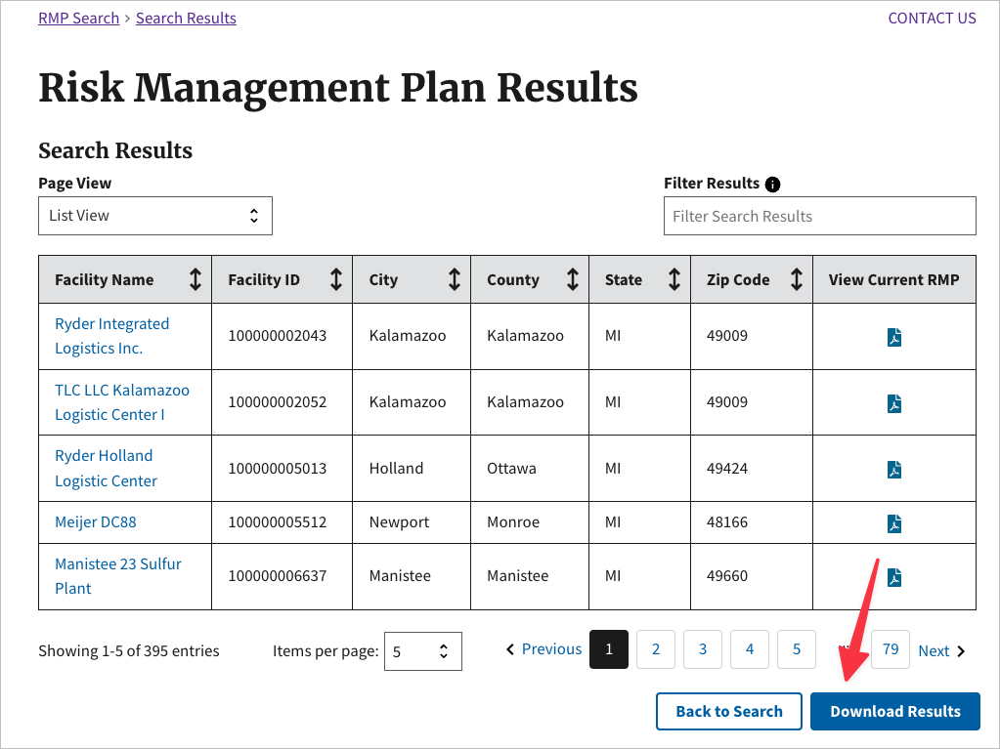
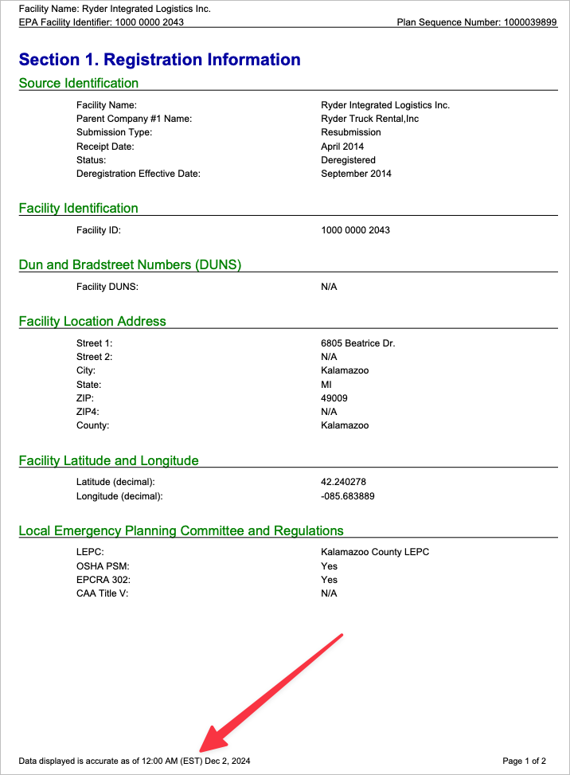

# Collecting RMP (Risk Management Plan) data from the EPA website.

An experiment  
Will Fitzgerald, 2024/12

## Current EPA system (as of 2024/12).

The EPA website provides a search tool to find RMP data for a specific facility. The search tool is located at the following URL: https://cdxapps.epa.gov/olem-rmp-pds/. The search tool allows users to search for RMP data by a variety of criteria.

Here is a screenshot:

If one selects just a state, there is an option to return results for all facilities in that state as an Excel file.

Individual RMPs can be downloaded from the search results page. As far as I can tell, these are generated when the request is made, so there is no direct link to the file. The RMP is timestamped.

Based on the Excel files the total Number of RMPs is 21,563. A few of the RMPs are not, in fact, downloadable, probably because they no longer exist. But, there are 21,560 RMPs in the `reports` directory.

Basic descriptive statistics are available in the [`stats.md`](stats.md) file.

## Data Collection

The data collection consisted of three steps:

1. Getting a list of states and territories.
2. Downloading the Excel files from the EPA website.
3. Using the Excel files, download the RMPs.

### Getting a list of states and territories

The list of states and territories was gathered from the EPA website, by inspecting the `State` option, and copying the list of states and territories. This list is in the file [`states.txt`](states.txt).

### Downloading the Excel files

The script `rmp_excel_by_state.py` did a search for each state and downloaded the Excel file. The Excel files are in the top level of the `reports` directory. For example, here is the file for Michigan: [`reports/Michigan.xls`](reports/Michigan.xls).

This script runs relatively quickly, and completes in under an hour.

### Downloading the RMPs

The script `rmp.py` reads the Excel files and downloads the RMPs. It does this by doing a search on the EPA website for each facility. The RMPs are in the `reports` directory. They are downloaded into a directory for the state. For example, here is the RMP for the facility with RMP number 100000002043: [`reports/michigan/100000002043.pdf`](reports/michigan/100000002043.pdf).

This script takes a long time to run. It took several days to download all the RMPs. The script is designed to be able to be restarted, so if it fails, it can be restarted without losing all the work. It is also designed to be able to be run in parallel, so that multiple instances can be run at the same time. On my machine, I ran 2 instances at the same time; more than this, and I ran into problems: perhaps due to memory on my machine, and perhaps due to limitations on the EPA website.

## Other scripts

There are a few other scripts in the repository:

- [`report_stats.py`](report_stats.py) generates the statistics in the [`stats.md`](stats.md) file.
- [`xls_to_sqlite.py`](xls_to_sqlite.py) converts the Excel files to a SQLite database. This is useful for querying the data.
- [`percent_complete.py`](percent_complete.py) shows the status of the RMP downloads.
- [`make_index_md.py`](make_index_md.py) was an attempt to generate an index of the RMPs. But the files are too large to be useful. The Excel files are the best way to look at individual states.

## Other notes

This project was created using the `uv` package manager, so to run the scripts, you will need to install the dependencies using `uv install` and then run the scripts using `uv run python <script>`.
